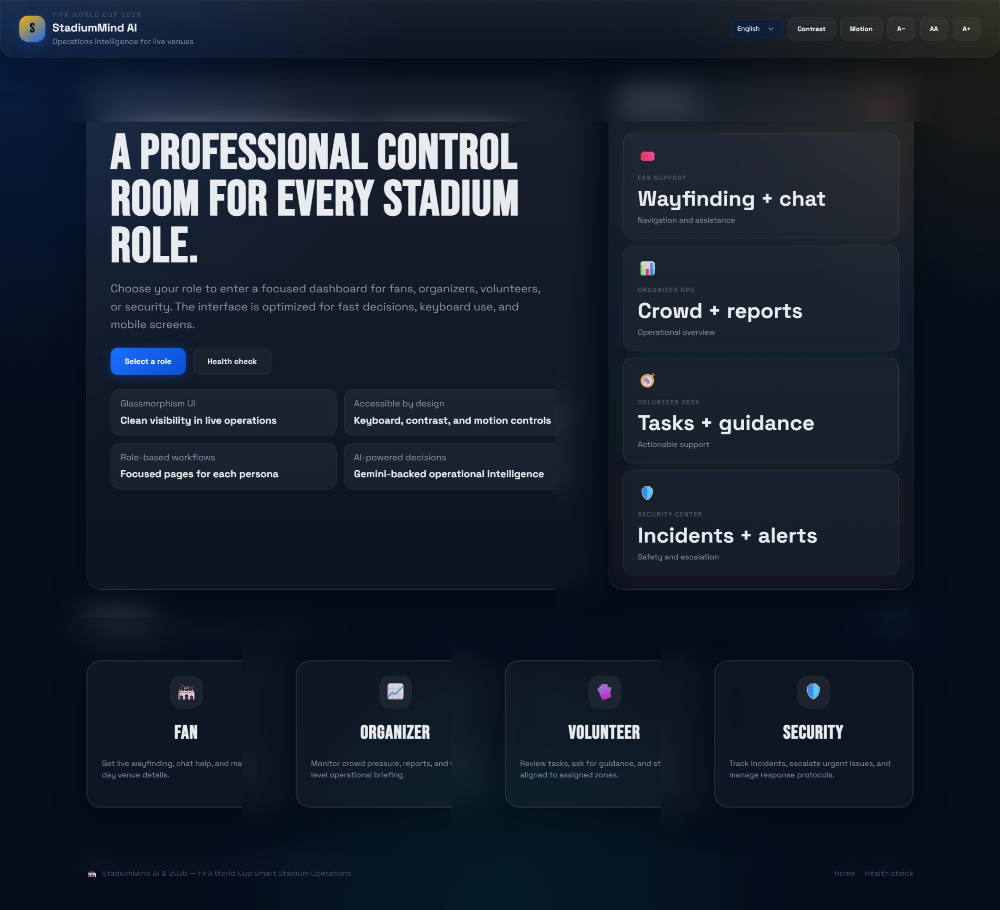
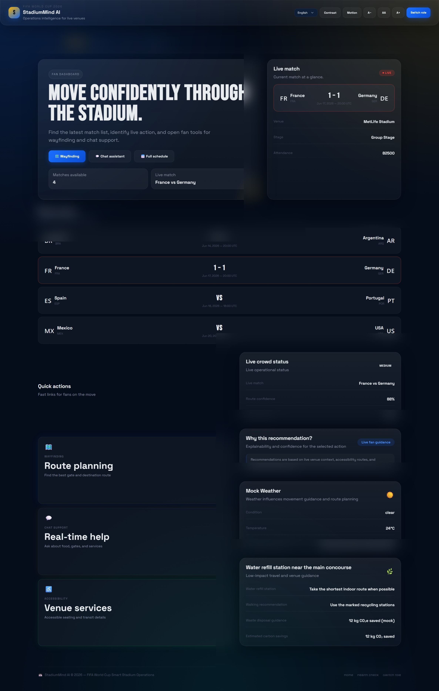
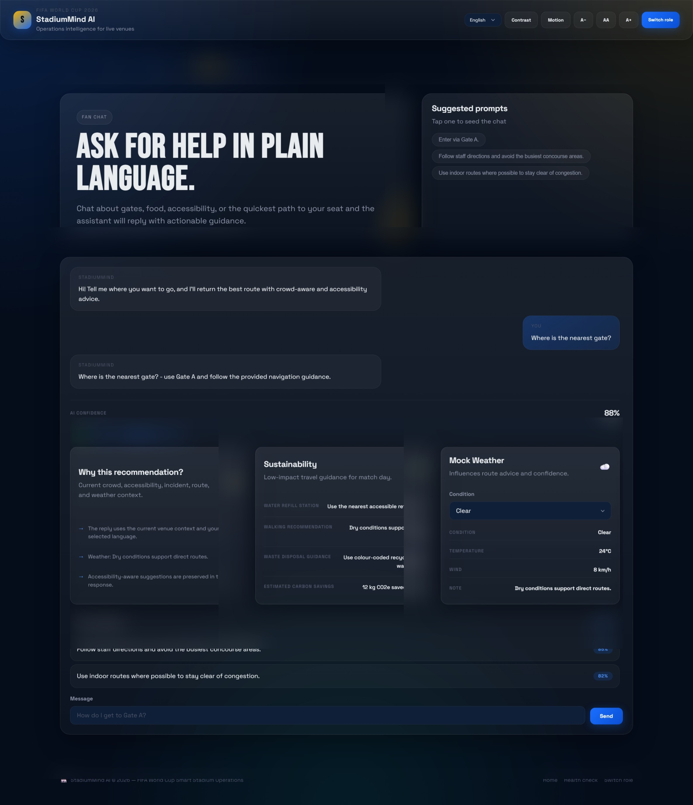
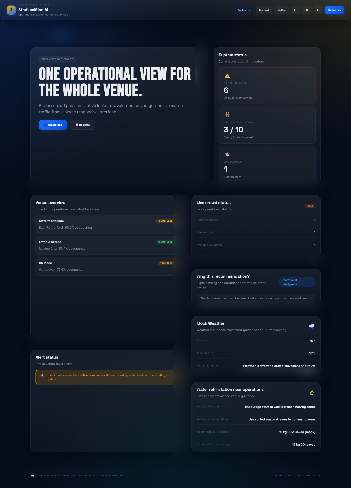
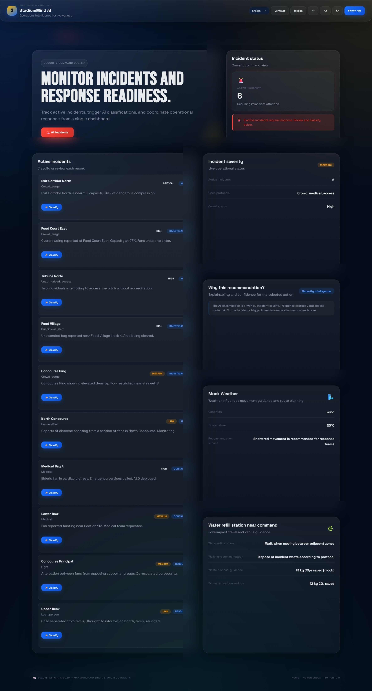
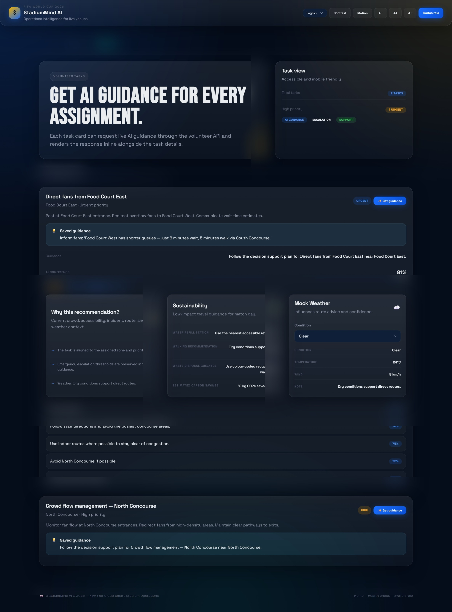

# 🏟️ StadiumMind AI

> **FIFA World Cup 2026 — Smart Stadium Operations Challenge**
>
> An AI-powered, role-based command centre for real-time crowd management,
> incident response, volunteer coordination, and fan assistance at live venues.

---

## 📋 Table of Contents

- [Overview](#overview)
- [Challenge Requirement Mapping](#challenge-requirement-mapping)
- [Architecture](#architecture)
- [Project Structure](#project-structure)
- [Module Responsibilities](#module-responsibilities)
- [AI Components](#ai-components)
- [Request Flow](#request-flow)
- [Tech Stack](#tech-stack)
- [Setup Instructions](#setup-instructions)
- [Running the Application](#running-the-application)
- [Features by Role](#features-by-role)
- [API Endpoints](#api-endpoints)
- [Testing](#testing)
- [Coverage](#coverage)
- [Deployment](#deployment)
- [Production Architecture](#production-architecture)
- [Accessibility](#accessibility)
- [Assumptions & Design Decisions](#assumptions--design-decisions)
- [Future Scope](#future-scope)
- [Screenshots](#screenshots)

---

## Overview

**StadiumMind AI** is a Flask-based web application that provides four distinct
role-focused dashboards for FIFA World Cup 2026 stadium operations:

| Role | Purpose |
|------|---------|
| 🎟️ **Fan** | Wayfinding, AI match assistant, crowd prediction, schedule |
| 📊 **Organizer** | Crowd analytics, resource allocation, briefing generation, alert broadcast |
| 🧤 **Volunteer** | Task assignment, priority management, AI task guidance, SOS escalation |
| 🛡️ **Security** | Threat detection, incident classification, risk analysis, emergency response |

---

## Challenge Requirement Mapping

Every challenge requirement maps directly to a named module, endpoint, and AI pipeline.

### 🎟️ Fan Features

| Requirement | Implementation |
|-------------|---------------|
| **AI Match Assistant** | `POST /fan/api/fan/chat` → `FanService.chat()` → `ai_service.ask("fan", "fan_chat")` |
| **Crowd Prediction** | Decision Engine crowd status embedded in wayfinding and chat responses |
| **Route Recommendation** | `GET /fan/api/fan/wayfinding` → `FanService.get_wayfinding()` → `DecisionEngine.safe_decide()` |
| **Stadium Navigation** | Wayfinding page + AI guidance with gate selection and crowd avoidance tips |
| **Emergency Alerts** | `urgent` flag surfaced through chat and wayfinding from `DecisionEngine._build_emergency_actions()` |

### 📊 Organizer Features

| Requirement | Implementation |
|-------------|---------------|
| **AI Resource Allocation** | `GET /organizer/api/organizer/crowd/analysis` → `OrganizerService.get_ai_crowd_analysis()` |
| **Incident Monitoring** | `GET /organizer/api/organizer/incidents` → `OrganizerService.get_all_incidents()` |
| **Venue Analytics** | `GET /organizer/api/organizer/crowd/live` → `OrganizerService.get_live_crowd()` |
| **Match Dashboard** | `GET /organizer/api/organizer/dashboard` → `OrganizerService.get_dashboard_summary()` |
| **AI Recommendations** | `POST /organizer/api/organizer/reports/generate` → `OrganizerService.generate_event_briefing()` |

### 🛡️ Security Features

| Requirement | Implementation |
|-------------|---------------|
| **Threat Detection** | `GET /security/api/security/zones/heatmap` → `SecurityService.get_zone_heatmap()` |
| **Incident Classification** | `POST /security/api/security/incidents/<id>/classify` → `SecurityService.classify_incident()` |
| **Risk Analysis** | AI response includes `severity`, `confidence`, `estimated_resolution_minutes` |
| **Emergency Response** | `GET /security/api/security/protocols/<type>` → `EMERGENCY_PROTOCOLS` registry |
| **AI Decision Support** | `DecisionEngine.safe_decide(user_role="security")` embedded in every classification |

### 🧤 Volunteer Features

| Requirement | Implementation |
|-------------|---------------|
| **Task Assignment** | `GET /volunteer/api/volunteer/tasks` → `VolunteerService.get_tasks_for_volunteer()` |
| **Priority Management** | Tasks returned sorted by `PRIORITY_ORDER` (urgent → high → medium → low) |
| **AI Task Recommendation** | `POST /volunteer/api/volunteer/ai-guidance` → `VolunteerService.get_ai_task_guidance()` |
| **Escalation Workflow** | `POST /volunteer/api/volunteer/sos` → `VolunteerService.submit_sos()` |
| **Live Coordination** | `GET /volunteer/api/volunteer/profile` → `VolunteerService.get_volunteer_by_id()` |

### ⚙️ Decision Engine

| Requirement | Implementation |
|-------------|---------------|
| **Crowd context** | `ContextBuilder._build_crowd_status()` |
| **Venue context** | `ContextBuilder._build_venue_context()` |
| **Match context** | `ContextBuilder._build_match_context()` |
| **Emergency context** | `ContextBuilder._build_emergency_status()` |
| **Gate selection** | `DecisionEngine._select_best_gate()` |
| **Navigation** | `DecisionEngine._build_navigation_advice()` |
| **Crowd avoidance** | `DecisionEngine._build_crowd_avoidance()` |
| **Emergency actions** | `DecisionEngine._build_emergency_actions()` |
| **Accessibility** | `DecisionEngine._build_accessibility_recommendations()` |
| **Transportation** | `DecisionEngine._build_transportation_suggestion()` |

---

## Architecture

```
┌─────────────────────────────────────────────────────────┐
│                    Browser Client                        │
│            (Vanilla JS + CSS Glassmorphism)              │
└───────────────────────┬─────────────────────────────────┘
                        │ HTTP
┌───────────────────────▼─────────────────────────────────┐
│                   Flask Application                      │
│                                                          │
│  ┌──────────┐ ┌──────────┐ ┌──────────┐ ┌──────────┐   │
│  │  Fan BP  │ │Organizer │ │ Security │ │Volunteer │   │
│  │ /fan/*   │ │  BP      │ │   BP     │ │   BP     │   │
│  └────┬─────┘ └────┬─────┘ └────┬─────┘ └────┬─────┘   │
│       │            │            │             │         │
│  ┌────▼─────┐ ┌────▼─────┐ ┌───▼──────┐ ┌───▼──────┐  │
│  │ Fan      │ │Organizer │ │Security  │ │Volunteer │  │
│  │ Service  │ │ Service  │ │ Service  │ │ Service  │  │
│  └────┬─────┘ └────┬─────┘ └────┬─────┘ └────┬─────┘  │
│       └────────────┴──────┬─────┴─────────────┘        │
│                           │                             │
│              ┌────────────▼──────────────┐              │
│              │       AI Layer            │              │
│              │  ┌────────┐ ┌──────────┐  │              │
│              │  │ai_svc  │ │Decision  │  │              │
│              │  │(Gemini)│ │ Engine   │  │              │
│              │  └────────┘ └──────────┘  │              │
│              └────────────┬──────────────┘              │
│                           │                             │
│              ┌────────────▼──────────────┐              │
│              │    Repository Layer       │              │
│              │  (JSON-backed CRUD)       │              │
│              └────────────┬──────────────┘              │
│                           │                             │
│              ┌────────────▼──────────────┐              │
│              │     /data/*.json          │              │
│              └───────────────────────────┘              │
└─────────────────────────────────────────────────────────┘
```

---

## Project Structure

```
stadiumind-ai/
├── app/
│   ├── __init__.py              # Flask application factory
│   ├── config.py                # Env-var driven configuration (Config, TestConfig)
│   ├── constants.py             # All magic numbers and hardcoded strings
│   │
│   ├── blueprints/              # HTTP route handlers — one Blueprint per persona
│   │   ├── __init__.py
│   │   ├── core.py              # Landing page, role selection, health check
│   │   ├── fan.py               # Fan pages + API (AI Match Assistant, Wayfinding, Chat)
│   │   ├── organizer.py         # Organizer pages + API (Dashboard, Crowd, Reports)
│   │   ├── volunteer.py         # Volunteer pages + API (Tasks, AI Guidance, SOS)
│   │   └── security.py          # Security pages + API (Incidents, Classification, Heatmap)
│   │
│   ├── services/                # Business logic layer — one Service per persona
│   │   ├── __init__.py
│   │   ├── fan_service.py       # FanService: schedule, wayfinding, AI chat
│   │   ├── organizer_service.py # OrganizerService: crowd analytics, briefings, alerts
│   │   ├── volunteer_service.py # VolunteerService: tasks, AI guidance, SOS
│   │   └── security_service.py  # SecurityService: incidents, classification, heatmap
│   │
│   ├── repositories/            # Data access layer — one Repository per entity
│   │   ├── __init__.py
│   │   ├── base.py              # Abstract BaseRepository (interface)
│   │   ├── json_base.py         # JSONRepository: atomic read/write implementation
│   │   ├── match_repo.py        # MatchRepository
│   │   ├── venue_repo.py        # VenueRepository
│   │   ├── crowd_repo.py        # CrowdRepository
│   │   ├── incident_repo.py     # IncidentRepository
│   │   └── volunteer_repo.py    # VolunteerRepository + TaskRepository
│   │
│   ├── models/                  # Domain model dataclasses and enums
│   │   ├── __init__.py
│   │   ├── match.py             # Match, Team
│   │   ├── venue.py             # Venue, Zone, Gate, FoodCourt
│   │   ├── crowd.py             # CrowdSnapshot, ZoneDensity, DensityLevel
│   │   ├── incident.py          # Incident, IncidentType, SeverityLevel, IncidentStatus
│   │   ├── volunteer.py         # Volunteer, Task, Shift, TaskStatus, TaskPriority
│   │   └── alert.py             # Alert, AlertPriority, AlertTarget
│   │
│   ├── ai/                      # AI integration layer
│   │   ├── __init__.py
│   │   ├── ai_service.py        # Central AI orchestrator: cache → prompt → Gemini → parse → fallback
│   │   ├── gemini_client.py     # Google Gemini API wrapper with retry + JSON output
│   │   ├── decision_engine.py   # Deterministic decision engine (ContextBuilder + DecisionEngine)
│   │   ├── prompt_manager.py    # Prompt template loader with prompt-injection protection
│   │   ├── response_parser.py   # AI response schema validator
│   │   ├── cache.py             # Thread-safe SHA-256 TTL cache for AI responses
│   │   └── prompts/             # Role-specific Gemini prompt templates
│   │       ├── fan_assistant.txt
│   │       ├── crowd_analysis.txt
│   │       ├── incident_classifier.txt
│   │       ├── volunteer_guidance.txt
│   │       └── event_briefing.txt
│   │
│   ├── middleware/              # Cross-cutting Flask hooks
│   │   ├── __init__.py
│   │   ├── role_guard.py        # Role-based access control decorator
│   │   ├── error_handler.py     # Global exception → JSON response mapping
│   │   └── request_logger.py    # Structured per-request logging
│   │
│   └── utils/                   # Shared utilities
│       ├── __init__.py
│       ├── response.py          # Standard API response envelope builder
│       ├── serializers.py       # Incident serialisation helpers + sort-order constants
│       ├── validators.py        # Input sanitisation (XSS-safe) and field validation
│       └── datetime_utils.py    # UTC formatting, human-readable time-until
│
├── data/                        # JSON data store (no database required)
│   ├── matches.json
│   ├── venues.json
│   ├── crowd.json
│   ├── incidents.json
│   ├── volunteers.json
│   └── tasks.json
│
├── templates/                   # Jinja2 HTML templates
│   ├── base.html                # Shared shell (topbar, footer, design system)
│   ├── components.html          # Reusable Jinja macros
│   ├── landing.html
│   ├── fan/
│   ├── organizer/
│   ├── volunteer/
│   ├── security/
│   └── errors/
│
├── static/
│   ├── css/
│   │   ├── tokens.css           # Design system variables (colours, spacing, motion)
│   │   ├── base.css             # Reset + typography + utility classes
│   │   ├── components.css       # UI component library
│   │   ├── layouts.css          # App shell and grid layouts
│   │   ├── animations.css       # Keyframes + animation utilities
│   │   └── frontend.css         # Page-specific glassmorphism styles
│   └── js/
│       └── app.js               # Client-side interactivity (Vanilla JS ES2020 IIFE)
│
├── tests/                       # Full test suite
│   ├── conftest.py              # Shared fixtures (app, fan_client, organizer_client, …)
│   ├── fixtures/                # Isolated test data (not production data)
│   ├── test_ai.py               # AI service, decision engine, prompt manager tests
│   ├── test_api.py              # Blueprint API endpoint integration tests
│   ├── test_errors.py           # Error handler tests
│   ├── test_models.py           # Domain model and enum tests
│   ├── test_repository.py       # Repository layer tests
│   ├── test_routes.py           # Page route tests
│   └── test_security.py        # Security middleware and role-guard tests
│
├── smoke_test.py                # End-to-end smoke test (standalone script)
├── run.py                       # Development server entry point
├── requirements.txt             # Production dependencies
├── requirements-dev.txt         # Dev/test dependencies (pytest, ruff, black, isort)
├── pytest.ini                   # pytest configuration
├── .coveragerc                  # Coverage configuration
└── .env.example                 # Environment variable template
```

---

## Module Responsibilities

| Module | Responsibility |
|--------|---------------|
| `app/__init__.py` | Flask app factory: configure, register blueprints, middleware, headers |
| `app/constants.py` | Single source of truth for all magic numbers and hardcoded strings |
| `app/config.py` | Environment-variable-driven config with `TestConfig` for isolation |
| `app/blueprints/` | Thin HTTP layer: validate input, call service, format response |
| `app/services/` | Business logic: compose repositories + AI, produce serialisable dicts |
| `app/repositories/` | Data access: atomic JSON read/write with model hydration |
| `app/models/` | Pure domain dataclasses and enums — zero framework dependency |
| `app/ai/ai_service.py` | Central AI orchestrator: 6-step pipeline (mock → cache → prompt → call → parse → fallback) |
| `app/ai/decision_engine.py` | Deterministic operational recommendations without a live AI call |
| `app/ai/gemini_client.py` | Google Gemini API wrapper: retry, JSON enforcement, timeout |
| `app/ai/prompt_manager.py` | Template loader with prompt-injection sandbox (`<user_input>` XML tag) |
| `app/ai/response_parser.py` | AI output schema validator: rejects malformed responses |
| `app/ai/cache.py` | Thread-safe SHA-256 TTL cache: eliminates redundant Gemini calls |
| `app/middleware/role_guard.py` | RBAC decorator: session-based, API-vs-page aware |
| `app/middleware/error_handler.py` | Maps HTTP codes and exceptions to structured JSON envelopes |
| `app/middleware/request_logger.py` | Structured per-request logging with request ID and duration |
| `app/utils/response.py` | Standard `success()` / `error()` JSON envelope builders |
| `app/utils/serializers.py` | Shared incident serialisers + sort-order constants |
| `app/utils/validators.py` | XSS-safe input sanitisation and required-field validation |
| `app/utils/datetime_utils.py` | UTC timestamp formatting and human-readable time-until |

---

## AI Components

### AI Service Pipeline (`ai_service.py`)

```
ask(persona, intent, context)
  │
  ├─ 1. MOCK_AI=true? → return _mock_response(intent)
  │
  ├─ 2. Build prompt from template (prompt_manager.build)
  │
  ├─ 3. Cache lookup (SHA-256 hash of prompt)
  │
  ├─ 4. Call Gemini API (gemini_client.generate)
  │       └─ Retry with exponential backoff (2 retries)
  │
  ├─ 5. Validate + parse response (response_parser.parse)
  │
  └─ 6. Cache result + return AIResult
         (fallback_used=True if any step fails)
```

### AI Intents

| Intent | Persona | Prompt Template | Output Schema |
|--------|---------|-----------------|---------------|
| `fan_chat` | Fan | `fan_assistant.txt` | `reply`, `suggestions`, `urgent` |
| `crowd_analysis` | Organizer | `crowd_analysis.txt` | `summary`, `severity`, `recommendations`, `prediction` |
| `incident_classify` | Security | `incident_classifier.txt` | `type`, `severity`, `confidence`, `steps`, `recommendation` |
| `volunteer_guidance` | Volunteer | `volunteer_guidance.txt` | `guidance`, `steps`, `fan_phrases`, `safety_notes` |
| `event_briefing` | Organizer | `event_briefing.txt` | `title`, `summary`, `key_points`, `priorities`, `action_items` |

### Decision Engine

The `DecisionEngine` produces deterministic recommendations **without** calling
Gemini, using only live JSON data:

```
safe_decide(user_role, venue_id)
  │
  ├─ ContextBuilder.build()
  │     ├─ _build_crowd_status()    ← CrowdRepository
  │     ├─ _build_venue_context()   ← VenueRepository
  │     ├─ _build_match_context()   ← MatchRepository
  │     ├─ _build_emergency_status() ← IncidentRepository
  │     └─ _build_weather_context() ← City-based mock
  │
  └─ DecisionEngine.decide()
        ├─ _select_best_gate()
        ├─ _build_navigation_advice()
        ├─ _build_crowd_avoidance()
        ├─ _build_emergency_actions()
        ├─ _build_accessibility_recommendations()
        └─ _build_transportation_suggestion()
```

---

## Request Flow

### Fan Chat Request

```
POST /fan/api/fan/chat
  │
  ├─ [fan.py] require_role("fan") — session check
  ├─ [fan.py] sanitize input, validate required fields
  ├─ [fan_service.py] FanService.chat(message, venue_id)
  │     ├─ VenueRepository.find_by_id(venue_id)
  │     ├─ MatchRepository.find_all() → filter live matches
  │     ├─ DecisionEngine.safe_decide() → decision_support
  │     └─ ai_service.ask("fan", "fan_chat", context)
  │           ├─ prompt_manager.build("fan_chat", context)
  │           ├─ cache.get(prompt_hash)  [cache hit → return]
  │           ├─ GeminiClient.generate(prompt)
  │           ├─ response_parser.parse("fan_chat", raw)
  │           └─ cache.set(prompt_hash, parsed)
  └─ [fan.py] success(data=result) → JSON 200
```

### Security Incident Classification Request

```
POST /security/api/security/incidents/<id>/classify
  │
  ├─ [security.py] require_role("security")
  ├─ [security_service.py] SecurityService.classify_incident(incident_id)
  │     ├─ IncidentRepository.find_by_id(incident_id)
  │     ├─ VenueRepository.find_by_id(incident.venue_id)
  │     ├─ DecisionEngine.safe_decide(user_role="security") → decision_support
  │     ├─ get_protocol(incident.type.value) → protocol steps
  │     ├─ _run_ai_classification() → ai_service.ask("security", "incident_classify")
  │     ├─ _persist_classification() → IncidentRepository.update()
  │     └─ return classification dict
  └─ [security.py] success(data=result, ai_powered=True) → JSON 200
```

---

## Tech Stack

| Layer | Technology |
|-------|-----------|
| **Web framework** | Flask 3.0.3 |
| **AI backend** | Google Gemini 1.5 Flash (`google-generativeai`) |
| **Environment** | `python-dotenv` |
| **Frontend** | Vanilla HTML5 + CSS3 + JavaScript (ES2020) |
| **Typography** | Space Grotesk + Bebas Neue (Google Fonts) |
| **Data** | JSON files (no database required) |
| **Session** | Flask signed cookie sessions |
| **Testing** | pytest + pytest-cov |
| **Linting** | Ruff + Black + isort |

> **No build step required.** The entire frontend runs as-is — no Node.js, no bundler, no transpilation.

---

## Setup Instructions

### 1. Prerequisites

- Python 3.10 or higher
- A Google Gemini API key (optional — mock mode available)

### 2. Clone and set up environment

```bash
git clone <repo-url>
cd stadiumind-ai

# Create and activate virtual environment
python -m venv .venv
# Windows
.venv\Scripts\activate
# macOS / Linux
source .venv/bin/activate

# Install dependencies
pip install -r requirements.txt
```

### 3. Configure environment variables

```bash
cp .env.example .env
```

Edit `.env`:

```env
# Required for production; a safe default is used for development
SECRET_KEY=your-long-random-secret-key

# Google Gemini AI (optional — app works without it)
GEMINI_API_KEY=your_gemini_api_key_here

# Set to true to run without any API key (uses realistic mock responses)
MOCK_AI=false

# Flask debug mode
FLASK_DEBUG=true
```

> **Running without a Gemini API key?** Set `MOCK_AI=true` in your `.env`. The application will use pre-built mock responses that accurately represent what real AI outputs look like.

---

## Running the Application

```bash
python run.py
```

The server starts at **http://localhost:5000**

```
🏟️  StadiumMind AI — FIFA World Cup 2026
   Running at: http://localhost:5000
   Debug mode: true
   Mock AI:    false
```

### Health check

```
GET http://localhost:5000/health
→ {"status": "ok", "service": "StadiumMind AI"}
```

---

## Features by Role

### 🎟️ Fan Dashboard (`/fan/`)

| Page | Feature |
|------|---------|
| **Home** | Live match display, quick action cards, match overview |
| **Wayfinding** | AI-powered Route Recommendation with crowd avoidance and accessibility options |
| **Chat** | AI Match Assistant — natural language queries (gates, food, seating, accessibility) |
| **Schedule** | Full fixture list with live match indicators |

### 📊 Organizer Dashboard (`/organizer/`)

| Page | Feature |
|------|---------|
| **Dashboard** | Match Dashboard — KPIs, venue occupancy, alert indicators |
| **Crowd** | Venue Analytics — live crowd snapshot by venue |
| **Reports** | AI Recommendations — operational briefing generation + Emergency Alert broadcast |

### 🧤 Volunteer Dashboard (`/volunteer/`)

| Page | Feature |
|------|---------|
| **Console** | Live Coordination — profile card, task preview, zone and skill summary |
| **Tasks** | Task Assignment + Priority Management + AI Task Recommendation per task |

### 🛡️ Security Dashboard (`/security/`)

| Page | Feature |
|------|---------|
| **Command** | Threat Detection — active incident triage with AI Decision Support |
| **Incidents** | Incident Classification — full history with severity and status badges |

---

## API Endpoints

All API routes require a valid role session set by the role selector.

| Method | Route | Role | Description |
|--------|-------|------|-------------|
| `GET` | `/health` | Public | Application health check |
| `GET` | `/fan/api/fan/matches` | fan | All matches |
| `GET` | `/fan/api/fan/matches/<id>` | fan | Match detail |
| `POST` | `/fan/api/fan/chat` | fan | **AI Match Assistant** |
| `GET` | `/fan/api/fan/wayfinding` | fan | **Route Recommendation** |
| `GET` | `/fan/api/fan/venue/<id>` | fan | Venue info |
| `GET` | `/organizer/api/organizer/dashboard` | organizer | **Match Dashboard** |
| `GET` | `/organizer/api/organizer/crowd/live` | organizer | **Venue Analytics** |
| `GET` | `/organizer/api/organizer/crowd/analysis` | organizer | **AI Resource Allocation** |
| `POST` | `/organizer/api/organizer/reports/generate` | organizer | **AI Recommendations** |
| `POST` | `/organizer/api/organizer/alerts/broadcast` | organizer | **Emergency Alerts** |
| `GET` | `/organizer/api/organizer/incidents` | organizer | **Incident Monitoring** |
| `GET` | `/volunteer/api/volunteer/profile` | volunteer | **Live Coordination** profile |
| `GET` | `/volunteer/api/volunteer/tasks` | volunteer | **Task Assignment** list |
| `PATCH` | `/volunteer/api/volunteer/tasks/<id>` | volunteer | **Priority Management** update |
| `POST` | `/volunteer/api/volunteer/ai-guidance` | volunteer | **AI Task Recommendation** |
| `POST` | `/volunteer/api/volunteer/sos` | volunteer | **Escalation Workflow** SOS |
| `GET` | `/security/api/security/incidents` | security | Incident list |
| `POST` | `/security/api/security/incidents` | security | Log new incident |
| `PATCH` | `/security/api/security/incidents/<id>` | security | Update incident |
| `POST` | `/security/api/security/incidents/<id>/classify` | security | **AI Incident Classification** |
| `GET` | `/security/api/security/zones/heatmap` | security | **Threat Detection** heatmap |
| `GET` | `/security/api/security/protocols/<type>` | security | **Emergency Response** protocol |

---

## Testing

### Run full test suite

```bash
pip install -r requirements-dev.txt
pytest tests/ -v
```

### Run smoke tests (standalone, no pytest required)

```bash
python smoke_test.py
```

### Run specific test modules

```bash
pytest tests/test_ai.py -v          # AI service and decision engine
pytest tests/test_api.py -v         # Blueprint integration tests
pytest tests/test_security.py -v    # Role guard and RBAC tests
pytest tests/test_repository.py -v  # Repository layer tests
```

### Test suite structure

| File | Tests | Coverage Area |
|------|-------|---------------|
| `test_ai.py` | AI service, mock responses, decision engine, cache, prompt manager |
| `test_api.py` | All blueprint endpoints, request/response validation |
| `test_errors.py` | 400/403/404/405/500 error handler responses |
| `test_models.py` | Domain model creation, enums, properties |
| `test_repository.py` | JSON CRUD operations, find, filter, update |
| `test_routes.py` | Page route rendering, redirects, role flow |
| `test_security.py` | Role guard, RBAC enforcement, cross-role blocking |

---

## Coverage

```bash
pytest tests/ --cov=app --cov-report=term-missing
```

Coverage is configured in `.coveragerc`. The test suite targets ≥90% coverage
across all application modules.

---

## Deployment

### Development

```bash
python run.py
```

### Production (Gunicorn)

```bash
pip install gunicorn
gunicorn "app:create_app()" --workers 4 --bind 0.0.0.0:8000
```

### Environment variables for production

| Variable | Required | Description |
|----------|----------|-------------|
| `SECRET_KEY` | ✅ | Long random string for session signing |
| `GEMINI_API_KEY` | ⬜ | Google Gemini API key (or set `MOCK_AI=true`) |
| `MOCK_AI` | ⬜ | `true` to use pre-built mock responses |
| `AI_MODEL` | ⬜ | Gemini model (default: `gemini-1.5-flash`) |
| `AI_MAX_TOKENS` | ⬜ | Max output tokens (default: `1024`) |
| `AI_CACHE_TTL` | ⬜ | Cache TTL in seconds (default: `300`) |
| `LOG_LEVEL` | ⬜ | Logging level (default: `DEBUG`) |
| `LOG_TO_FILE` | ⬜ | `true` to write logs to file |

---

## Production Architecture

For a production deployment at World Cup scale, the architecture would evolve as follows:

```
┌─────────────┐     ┌─────────────┐     ┌─────────────────────┐
│  CDN / WAF  │────▶│  Load       │────▶│  Gunicorn + Flask   │
│  (Cloudflare│     │  Balancer   │     │  (K8s Deployment)   │
│  / AWS CF)  │     │  (NGINX /   │     │  Auto-scaled pods   │
└─────────────┘     │  AWS ALB)   │     └──────────┬──────────┘
                    └─────────────┘                │
                                       ┌───────────▼──────────┐
                                       │  Redis Cache         │
                                       │  (AI response TTL)   │
                                       └───────────┬──────────┘
                                                   │
                                       ┌───────────▼──────────┐
                                       │  PostgreSQL +        │
                                       │  SQLAlchemy          │
                                       │  (replaces JSON)     │
                                       └───────────┬──────────┘
                                                   │
                                       ┌───────────▼──────────┐
                                       │  Google Gemini API   │
                                       │  (via Vertex AI)     │
                                       └──────────────────────┘
```

**Scaling considerations:**
- Replace in-process TTL cache with Redis for shared cache across pods
- Replace JSON files with PostgreSQL + SQLAlchemy
- Use Vertex AI for Gemini instead of direct API for enterprise SLAs
- Add WebSocket layer (Socket.IO / ASGI) for real-time crowd push updates
- SIEM integration for security incident audit trail

---

## Accessibility

StadiumMind AI is built with WCAG 2.1 AA compliance as a target:

| Feature | Implementation |
|---------|---------------|
| **Skip navigation** | `<a class="skip-link" href="#main-content">` at top of every page |
| **Keyboard navigation** | All interactive elements reachable and operable via keyboard |
| **Focus indicators** | Gold `outline` on `:focus-visible` — visible and distinct |
| **Screen reader labels** | `aria-label`, `aria-labelledby`, `aria-describedby`, `aria-live` throughout |
| **High contrast mode** | Toggled via toolbar; uses `[data-theme="high-contrast"]` CSS override |
| **Reduced motion** | Toggled via toolbar; `html[data-motion="reduced"]` disables all animations |
| **Font scaling** | Toolbar `A− / AA / A+` scales `html { font-size }` via `--font-scale` custom property |
| **Language selector** | Switches UI language between EN, ES, FR, HI via `localStorage` |
| **Color contrast** | All text/background pairs meet WCAG AA minimum 4.5:1 ratio |
| **Live regions** | Chat log uses `role="log"` + `aria-live="polite"`; critical alerts use `aria-live="assertive"` |
| **Semantic HTML** | `<main>`, `<header>`, `<footer>`, `<nav>`, `<section>`, `<article>` used correctly throughout |

---

## Assumptions & Design Decisions

### Data Layer
- All venue, match, crowd, incident, volunteer, and task data is stored in JSON files in `/data/`. This avoids database setup overhead while accurately simulating a live operational context.
- Repositories use atomic writes (temp file → rename) to prevent partial reads on crash.

### AI Integration
- The application uses Google Gemini 1.5 Flash for all AI calls, managed via a centralised `ai_service` and `DecisionEngine`.
- A SHA-256 TTL cache prevents redundant API calls for identical inputs.
- When `MOCK_AI=true`, realistic pre-built responses simulate the full AI flow without a real API key.
- The Decision Engine provides deterministic fallbacks so AI features degrade gracefully.

### Security
- Role selection sets a signed session cookie (Flask `SECRET_KEY`). No JWT, no database.
- All user input is sanitised with `html.escape()` + length truncation before processing.
- Prompt injection is prevented by sandboxing user content in `<user_input>` XML tags.
- Security headers (CSP, X-Frame-Options, HSTS-ready) applied on every response.

### Constants Module
- All magic numbers and repeated string literals are centralised in `app/constants.py`.
- This single file is the authoritative reference for thresholds, ID prefixes, role names, intent strings, and HTTP status codes.

---

## Future Scope

### Short-term (next sprint)
- [ ] WebSocket real-time push for crowd density updates
- [ ] PWA manifest for offline-capable fan experience
- [ ] Volunteer check-in / check-out tracking

### Medium-term
- [ ] Multi-venue switching within the same session
- [ ] Staff authentication via Google OAuth
- [ ] Exportable PDF operational briefings

### Long-term / Production
- [ ] Replace JSON data store with PostgreSQL + SQLAlchemy
- [ ] Real CCTV integration for computer-vision-based crowd counting
- [ ] Multi-language AI responses (Gemini supports 40+ languages natively)
- [ ] Role-based audit logging to SIEM system
- [ ] Kubernetes deployment with horizontal pod autoscaling

---

## Screenshots

### Landing Page
Role selector with glassmorphism cards.




### Fan Dashboard
Live match information with wayfinding quick actions.




### Fan Chat
AI Match Assistant with suggestion chips.




### Organizer Dashboard
KPI cards and venue occupancy overview.




### Security Command Center
Active incident triage view with AI classification.




### Volunteer Tasks
AI Task Recommendation panel.



---

## Development

```bash
# Install dev dependencies (linting + testing)
pip install -r requirements-dev.txt

# Run linter
ruff check .

# Format code
black .

# Sort imports
isort .

# Run tests with coverage
pytest tests/ --cov=app --cov-report=term-missing

# Run smoke tests
python smoke_test.py

# Run with debug reload
FLASK_DEBUG=true python run.py
```

---

## Live Demo

https://stadiumind-ai-1.onrender.com

---

## Licence

This project is submitted as a hackathon entry for the **FIFA World Cup 2026 Smart Stadium Operations Challenge**. All code is original.

---

*Built with 🏟️ by the StadiumMind AI team — 2026*
